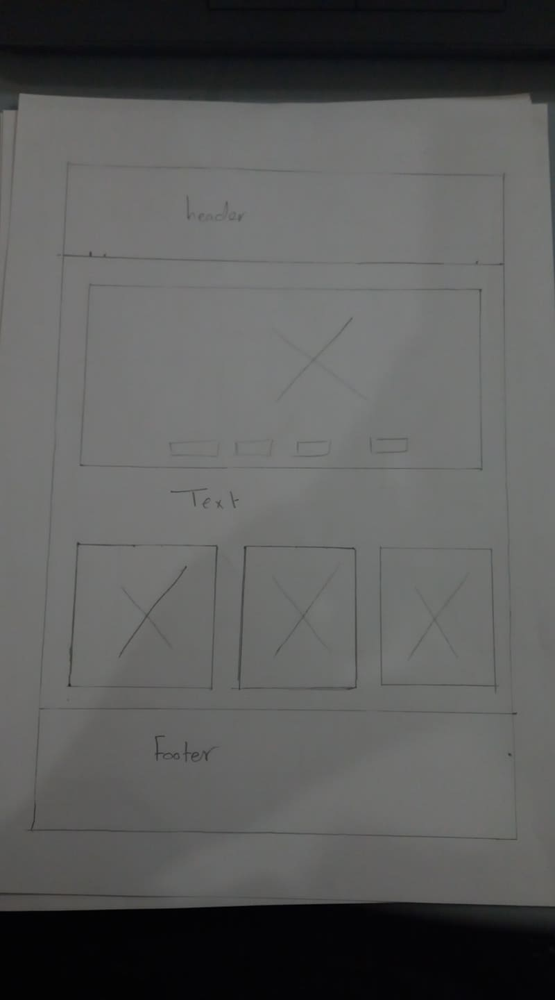
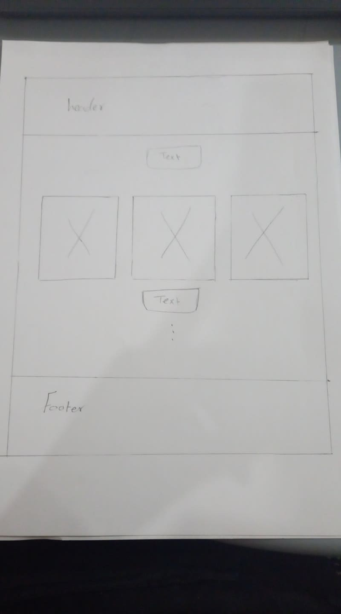
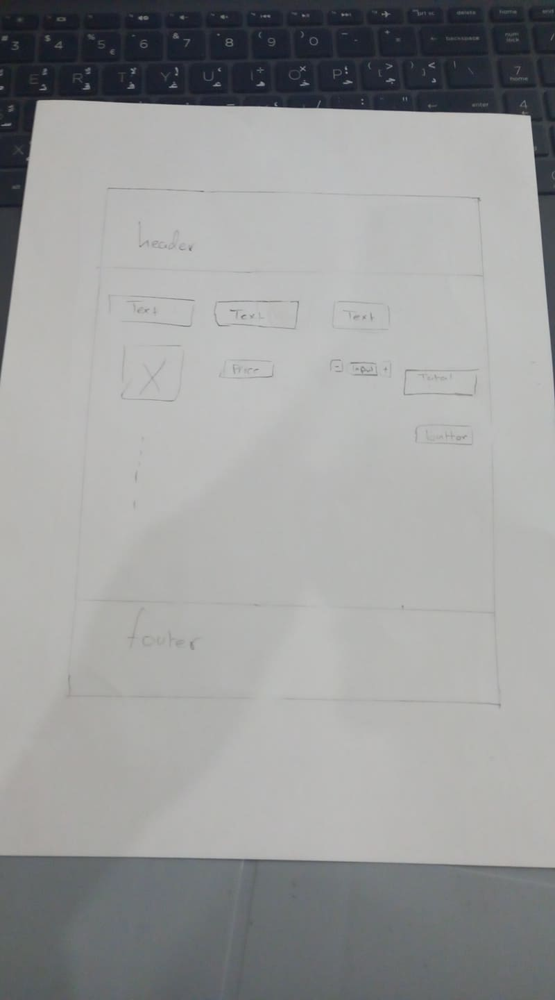
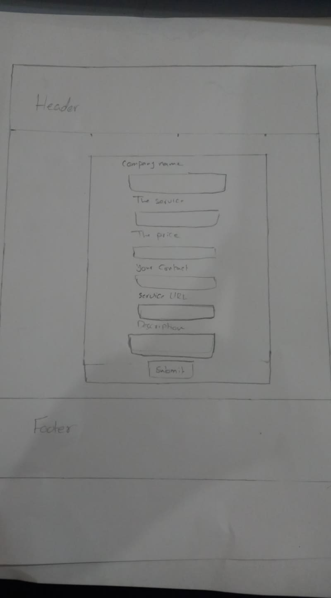
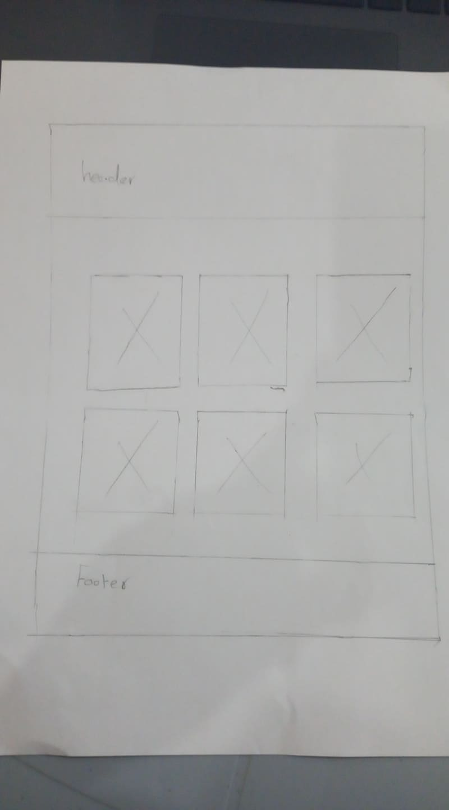
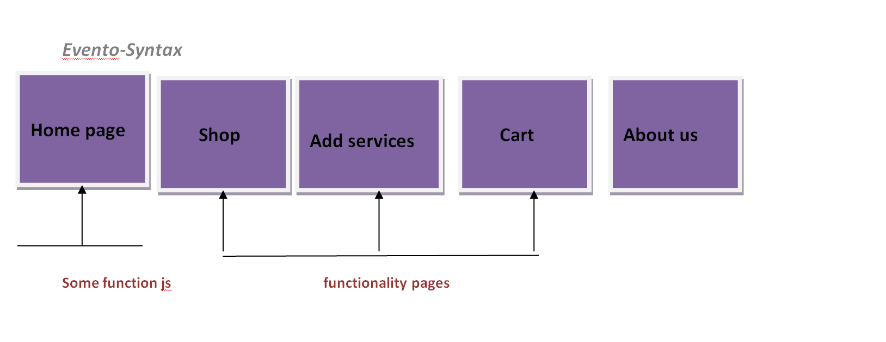

# Evento-Syntax 

## Group members:

Amara albalkhi

Haneen abonaser

Motasim alazzam

Sanabel abu ezbead

Eman almkhareez

Reem bani ali 

# PROBLEM DOMAIN 

There is difficult to collect every things about event so to make  it more Facilitation we make our website , to introduce service for doing 

events by contain all products for events.

Every company around the world need to make events in special day every year , and these events require a lot of planning to complete it in the

 best way . so the **eventoSyntax** here to fully  plan and organize  events . as well as to save  companys' time ,effort and cost for organization 
 
 event 

## language:
html

css 

javascript

## resource:

w3schools

YouTube

## User Stories

1. ***As a user I want to see website's name and some definition of website's goals and funding resources.***

2. ***As a user I want to see some nice style that giving a comforte for me.***

3. ***As a user I want to see a readable font size and family.***

4. ***As a user I want to use some functionality that make the experiement easier.***

5. ***As a user I want to see all products in shop page and when I choose any product  then save this product  inside cart page.***

6. ***As a user I want to see if I can add sevice to share it with the website.***

7. ***As a user I want to see header that contain all pages and some information about the development team.***

**Home Page**

**Shop Page** 

**Cart Page**

**Form Page**

**About Us Page**

